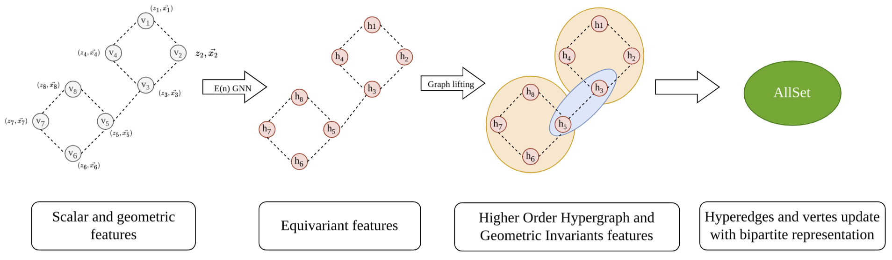

# EquiHGNN: Scalable Rotationally Equivariant Hypergraph Neural Networks

## Abstract

Molecular interactions often involve high-order relationships that cannot be fully captured by traditional graph-based models limited to pairwise connections. Hypergraphs naturally extend graphs by enabling multi-way interactions, making them well-suited for modeling complex molecular systems. In this work, we introduce EquiHGNN, an Equivariant Hypergraph Neural Network framework that integrates symmetry-aware representations to improve molecular modeling. By enforcing equivariance under relevant transformation groups, our approach preserves geometric and topological properties, leading to more robust and physically meaningful representations. We examine a range of equivariant architectures and demonstrate that integrating symmetry constraints leads to notable performance gains on large-scale molecular datasets. Experiments on both small and large molecules show that high-order interactions offer limited benefits for small molecules but consistently outperform 2D graphs on larger ones. Adding geometric features to these high-order structures further improves performance, emphasizing the value of spatial information in molecular learning.

<p align="center">
   <br/>
   <i>
    Overview of the Equivariant Hypergraph Neural Network framework (EquiHGNN).
  </i>

</p>

## Datasets

This project currently utilizes four main datasets:

- **OPV**: The Organic Photovoltaic (OPV) dataset contains molecular structures and their corresponding photovoltaic properties.
- **QM9**: The QM9 dataset consists of small molecules with geometric, energetic, electronic, and thermodynamic properties.
- **PCQM4Mv2**: From the PubChemQC project, this dataset of ~3.7M molecules supports quantum chemistry tasks like predicting HOMO–LUMO gaps from SMILES; useful for materials discovery and drug design.
- **Molecule3D**: Also based on PubChemQC, this benchmark includes ~3.9M molecular graphs for predicting 3D structures and quantum properties from 2D inputs, supporting applications in molecular modeling and property prediction.

## Setup

First, create and activate a Conda environment:

```shell
conda create --name equihgnn python=3.10
conda activate equihgnn
make
```

## Train the Model

Training parameters, including model type, dataset selection, and hyperparameters, are configurable within the `./scripts` directory. A flexible interface allows easy model selection using the `--method` flag. The following models are supported:

- `gin`, `gat`: 2D Graph Neural Network.
- `mhnnm`: Molecular Hypergraph Neural Network (baseline).
- `egnn_equihnns`: Equivariant Graph Neural Network (EGNN) integration for geometric feature extraction.
- `equiformer_equihnns`: Equiformer integration for geometric feature extraction.
- `faformer_equihnns`: Frame Averaging Transformer (FAFormer) integration for geometric feature extraction.

### OPV

OPV dataset task IDs:

- **Molecular**: 0-gap, 1-homo, 2-lumo, 3-spectral_overlap
- **Polymer**: 4-homo, 5-lumo, 6-gap, 7-optical_lumo

```shell
# Without geometric:
bash scripts/run_opv.sh $TASK_ID

# With geometric:
bash scripts/run_opv_3d.sh $TASK_ID
```

### QM9

QM9 dataset task IDs: 0-mu, 1-alpha, 2-homo, 3-lumo, 4-epsilon, 5-$R^2$

```shell
# Without geometric:
bash scripts/run_qm9.sh $TASK_ID

# With geometric:
bash scripts/run_qm9_3d.sh $TASK_ID
```

### PCQM4Mv2

```shell
# Without geometric:
bash scripts/run_pcqm.sh

# With geometric:
bash scripts/run_pcqm_3d.sh
```

### Molecule3D

Molecule3D dataset task IDs 0-dipole x, 1-dipole y, 2-dipole z, 3-homo, 4-lumo, 5-homolumogap, 6-scf-energy

```shell
# Without geometric:
bash scripts/run_molecule.sh $TASK_ID

# With geometric:
bash scripts/run_molecule_3d.sh $TASK_ID
```

## Training with Docker

Build the Docker image:

```shell
docker build -t equihgnn .
```

Run training inside a Docker container:

```shell
docker run \
  --gpus all \
  -v ./datasets:/module/datasets \
  -v ./logs:/module/logs \
  -v ./scripts:/module/scripts \
  -e COMET_API_KEY=$(COMET_API_KEY) \
  equihgnn bash scripts/*.sh $TASK_ID
```

## Acknowledgements

This project utilizes code and inspiration from the following open-source repositories:

- **MHNN Baseline:** [schwallergroup/mhnn](https://github.com/schwallergroup/mhnn)
- **EGNNs:** [lucidrains/egnn-pytorch](https://github.com/lucidrains/egnn-pytorch)
- **SE(3) Transformers:** [lucidrains/se3-transformer-pytorch](https://github.com/lucidrains/se3-transformer-pytorch)
- **Equiformer:** [lucidrains/equiformer-pytorch](https://github.com/lucidrains/equiformer-pytorch)
- **Frame Averaging Transformer:** [Graph-and-Geometric-Learning/Frame-Averaging-Transformer](https://github.com/Graph-and-Geometric-Learning/Frame-Averaging-Transformer)
- **VisNet:** [pyg-team/pytorch_geometric](https://github.com/pyg-team/pytorch_geometric/blob/2f1e4f2e666db65056d001650488be9b31f8dd0f/torch_geometric/nn/models/visnet.py)
