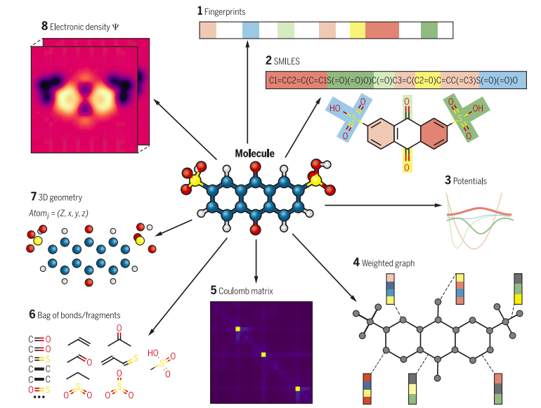

### Abstract (draft)

Graph neural networks (GNNs) have shown remarkable success in chemistry-related tasks, yet traditional graph models are limited to pairwise connectivity and fail to capture higher-order molecular interactions like multi-center bonds and conjugated structures. Recent advancements with Molecular Hypergraph Neural Networks (MHNNs) address this limitation by incorporating hyperedges to represent these complex connections, outperforming baseline models even without 3D geometric information. However, integrating 3D geometric data remains crucial, as 3D structural effects, such as conformational isomers, significantly influence molecular properties. This integration poses challenges in maintaining SO(3) equivariance within the hypergraph's higher-order structure. This work proposes an extension to MHNNs by incorporating geometric information equivariantly.

### Data

Dataset: Molecules with **Atoms 3D Coordinates** (sdf, babel DFT-optimized) and **2D Graph** (smile)
+ Organic Photovoltaic (OPV) in MHNN
+ Quantum Machine 9 (QM9) in E(n) Topo NN

⭐ Train QM9 with MHNN and OPV with E(n) Topo NN

### MHNN

- OPV 3D Info used in the baseline of SchNet. ⚠️ Other datasets than OPV may not have 3D Info readily available.
<!-- - ⚠️ Model in training code of OPV being `MHNNS` not the architecture in paper i.e not using bond information
- ⚠️ Loss being `nn.MSELoss()` not the metric in paper -->

### E(n) Topo NN
**Similar approach to E(n) Equivariant GNN**

⭐ Use spherical harmonic approach

### E(n) Topo NN vs MHNN 
- E(n) Topo NN is an extension of MHNN with addition of geometric information
- MHNN Paper consider hyperedge as rank 1 like pairwise edge. To use geometric atom, we must use the **relative** position with each other. For pairwise it is the distance and direction calculated from two atom absolute coordinates. So for MHNN hyperedge, it is difficult to use the atom positional information.

> In a molecular CC, the set of nodes S is the set of atoms, while the set of cells X and the rank function rk are such that: atoms are 0-cells, bonds and functional groups made of two atoms are 1-cells, and rings and functional groups made of more than two atoms are 2-cells

- In E(n) Topo NN, hyperedge is rank 2. Their features are calculated from the incident node (cell rank 0), the incident pairwise edges (cell rank 1), and adjacent hyperedge (cell rank 2) with the **cell feature** and **child node positional feature**. The **positional** features are calculated in the E(n) GNN manner from all nodes in the neighborhood of different ranks.
  - $\mathcal{S}$: set of nodes, $\mathcal{X}$: set of cells, $\mathcal{C N}$: neighborhood functions
  - $\mathbf{h}_x^{l+1}=\beta(\mathbf{h}_x^l, \bigotimes_{\mathcal{N} \in \mathcal{C N}} \bigoplus_{y \in \mathcal{N}(x)} \underbrace{\psi_{\mathcal{N}, \mathrm{rk}(x)}\left(\mathbf{h}_x^l, \mathbf{h}_y^l, \operatorname{Inv}\left(\left\{\mathbf{x}_z^l\right\}_{z \in x},\left\{\mathbf{x}_z^l\right\}_{z \in y}\right)\right)}_{\mathbf{m}_{x, y}^{\mathcal{N}}})$, for all $x \in \mathcal{X}$

  - $\mathbf{x}_z^{l+1}=\mathbf{x}_z^l+C \sum_{\mathcal{N} \in \mathcal{C N}} \sum_{t \in S:\{t\} \in \mathcal{N}(z)}\left(\mathbf{x}_z^l-\mathbf{x}_t^l\right) \xi\left(\mathbf{m}_{z, t}^{\mathcal{N}}\right)$, for all $z \in \mathcal{S}$,

👀 Is it possible to get the hyperedge feature directly while keeping it as rank 1 edge? What could be the shared representation for both pairwise edges and hyperedges positional features?

### TODO
